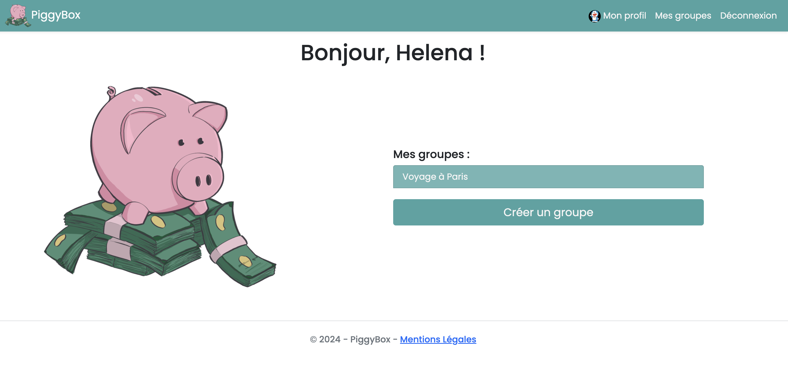
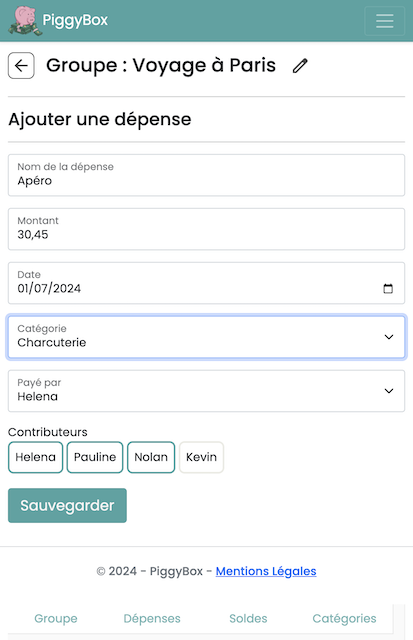
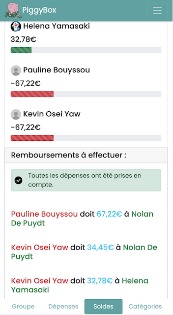

# Piggy Box App


## Table of Contents

- [About](#about)
- [Contributors](#contributors)
- [Built with](#built-with)
- [Installation](#installation)

### About

Piggy Box is an application developed during a C# course. The primary goal of this application is to help users create groups and manage expenses effectively.

By creating an account in Piggy Box, users can create groups, track expenses, and add participants to each expense. The application calculates the amount each participant needs to contribute, making it easier to settle group expenses.

Additionally, Piggy Box allows you to organize your expenses by creating categories within your groups, ensuring that your finances are well-structured and easy to manage.


\
*Home page in desktop version*

\
*Expense creation page in mobile version*

\
*Balance displayed in mobile version*

### Contributors

- [Helena](https://github.com/lena-my)
- [Nolan](https://github.com/Aeldro)
- [Kevin](https://github.com/K-Dawg92)
- [Pauline](https://github.com/popobg)


### Built with

- [C# .NET 8.0](https://learn.microsoft.com/en-us/dotnet/csharp/)
- [Razor Pages](https://learn.microsoft.com/en-us/aspnet/core/razor-pages/?view=aspnetcore-8.0&tabs=visual-studio)

### Installation

Clone the repository:

```shell script
git clone https://github.com/Aeldro/PiggyBox.git
```


